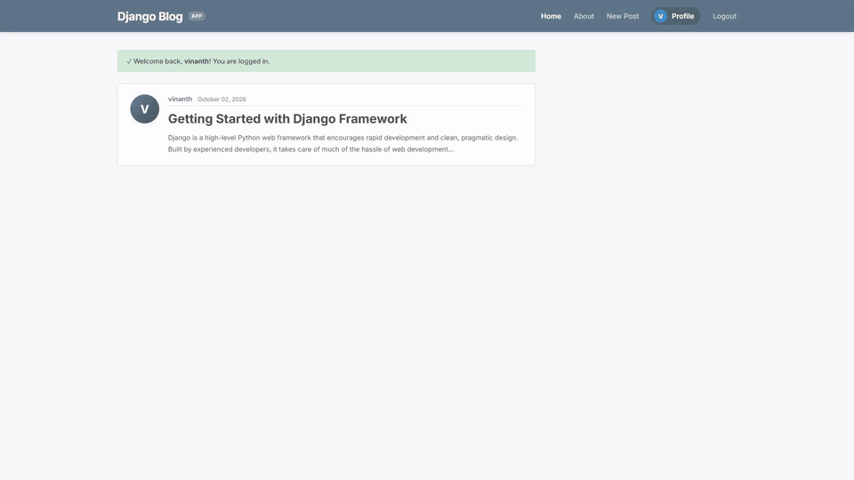

# Django Blog App



> A full-featured, production-ready blogging web application built with Python 3.12 and Django 5.0. Features custom user authentication, profile management with avatars, paginated post feeds, author-restricted CRUD operations, and Bootstrap styling.

## 🎬 Project Demo

The animated preview above demonstrates the real Django Blog application interface in action. 

- 🔊 **Watch full HD video with audio & SFX**: [`brag-output/brag.mp4`](brag-output/brag.mp4)
- 🖼️ **Poster Frame**: [`brag-output/brag.jpg`](brag-output/brag.jpg)

---

## ✨ Features

- 🔐 **User Authentication**: Secure registration, login, logout, and password reset functionality.
- 👤 **Custom User Profiles**: User profiles with custom avatar image uploading and email/username management.
- 📰 **Paginated Feed**: Clean article list with pagination (`First`, `Previous`, `Next`, `Last`).
- ✍️ **Full CRUD Operations**: Create, read, update, and delete posts (restricted to post authors).
- 🎨 **Responsive UI**: Steel-blue navbar layout with sidebars and flash message alerts.

---

## 🚀 Quick Start

### 1. Clone the repository
```bash
git clone https://github.com/Vinanth-P/Django_blog_app.git
cd Django_blog_app
```

### 2. Create and activate a virtual environment
```bash
python -m venv venv

# Windows (PowerShell)
.\venv\Scripts\Activate.ps1

# macOS / Linux
source venv/bin/activate
```

### 3. Install dependencies
```bash
pip install django pillow
```

### 4. Run migrations & load sample data
```bash
python manage.py migrate
```

### 5. Start the server
```bash
python manage.py runserver
```
Visit `http://127.0.0.1:8000/` in your browser.

---

## 📁 Media & Brag Assets

- 🎞️ **Inline GIF**: [`brag-output/brag.gif`](brag-output/brag.gif)
- 🎥 **HD Video (with sound)**: [`brag-output/brag.mp4`](brag-output/brag.mp4)
- 🖼️ **Poster Image**: [`brag-output/brag.jpg`](brag-output/brag.jpg)
- 📝 **Launch Copy**: [`brag-output/share-copy.txt`](brag-output/share-copy.txt)
- 📋 **Video Storyboard**: [`brag-output/brag-plan.md`](brag-output/brag-plan.md)
